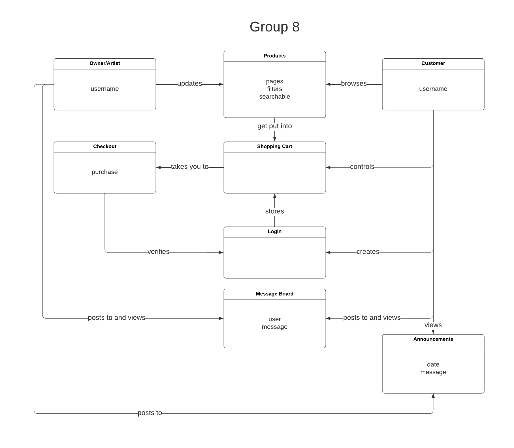

# PROJECT Design Documentation

## Team Information
* Team name: TEAM 8
* Team members
  * Alex Hetrick
  * Alex Martinez
  * Kara Kolodinsky
  * Jonathan Campbell
  * Daniel Kench

## Executive Summary

### Purpose
Our program is an e-store targeted towards fans of a tattoo artist who sells their designs on products. 
Customers are able to buy those products, learn information via the announcements feature, and chat in a chatroom with other users. 

### Glossary and Acronyms

| Term | Definition |
|------|------------|
| SPA | Single Page |
| DAO | Data access object |

## Requirements

This section describes the features of the application.

- Inventory management
- Item browsing
- Authentication (login/logout)
- Cart management
- Checking out
- Viewing and posting announcements
- Data persistence
- Chatting with other users

### Definition of MVP
A store where you can view items for sale by the artist, add these items to your cart, and then purchase them. You can also login to an account in order to save your cart, view store-wide announcements that the artist has posted, and chat with other users. As the owner of the store, the artist, you can add, delete, or update items in the inventory, as well as post store-wide announcements to the site.

### MVP Features
- Inventory management
- Item browsing
- Authentication (login/logout)
- Cart management
- Checking out
- Data persistence

### Roadmap of Enhancements
- Announcements
- Messaging

## Application Domain

This section describes the application domain.

The customer can browse an inventory of products on the website, and add the ones they like to the shopping cart. If logged in, this shopping cart will persist between sessions. The user can then checkout and purchase the items in the cart. If the owner is logged in, they are able to update the inventory and also post store-wide annoucenements, which the customers can see. The customers also have the option to contact the owner to request custom paintings, and the customers will be able to communicate about that though an in-site messaging service.

## Architecture and Design

This section describes the application architecture.

### Summary

The following Tiers/Layers model shows a high-level view of the webapp's architecture.

The e-store web application, is built using the Model–View–ViewModel (MVVM) architecture pattern. 

The Model stores the application data objects including any functionality to provide persistance. 

The View is the client-side SPA built with Angular utilizing HTML, CSS and TypeScript. The ViewModel provides RESTful APIs to the client (View) as well as any logic required to manipulate the data objects from the Model.

Both the ViewModel and Model are built using Java and Spring Framework. Details of the components within these tiers are supplied below.

### Overview of User Interface

This section describes the web interface flow; this is how the user views and interacts
with the e-store application.

> _Provide a summary of the application's user interface.  Describe, from
> the user's perspective, the flow of the pages in the web application._

### View Tier

Our View Tier UI includes a login page where a user can create an account or login into an account that has already been made. The View Tier also includes a
homepage and products page (where the user can view products for sale). There is also a cart page (where the user can view items in their cart) and subsequently
a checkout page (where the user can purchase the items in their cart) and a confirmation page that confirms their purchase. Finally, there are message and
announcement pages (where the user can view announcements made by the admin and speak to other users). There is also an about page and contanct page (where the 
user can learn more about the admin)

### ViewModel Tier
The DAO files in the persistence folder make up the ViewModel Tier. These files use the information contained in the Model Tier components to implement functionality that will then be used by the View Tier components. The DAO files are first created as an interface to decide what methods are needed. Then these methods are implemented in the FileDAO files. For instance in the file MessageDAO, I decided what specific methods I would need, such as getMessages(), findMessages(), etc. Then in the file MessageFileDAO, I created the messages structure out of a map, and created the needed functionality, like searching through the map in the findMessages() method. This tier is where most of the logic for the different objects is, whereas the Model has the necessary data, and the View then makes use of this now created logic.

### Model Tier
The model tier contains components that are representations of objects such as store items, announcements, and messages. Each object has properties that can be set and retrieved individually.

The ViewModel tier translates file information into these objects that are then sent to the view tier to be sent to the front end.

### Static Code Analysis/Design Improvements
Here are the up-to-date SonarQube and SonarScanner reports for both the Java and TypeScript portions of our project:

There are a number of areas that have been flagged by SonarQube that would be beneficial to give our attention to and fix in the future:
#### 1: Variable names

We seem to have a lack of cohesion and agreement on how to name our variables and classes throughout the project. This is likely due to us not giving it much thought as we work on individual pieces together, and then not reviewing closely enough during code reviews. Claifying this before any code is written and performing more thorough code reviews would most likely solve this issue.
#### 2: Modifying static variables from non-static methods

Updating a static field from a non-static method is tricky to get	right and could easily lead to bugs if there are multiple class instances and/or	multiple threads in play. Ideally, static fields are only updated from synchronized static methods. We could create synchronized static accessors for each static field, such as "nextId", and only modify the field's value through those methods.
#### 3: Using default package visibility instead of "public" for methods and classes

In this context, test classes can have any visibility but private, however, it is recommended to use the default package visibility, which improves readability of code. This isn't a pressing issue and only harms the readability of the code, but it is an easy fix for us to make as we can simply remove all of the public keywords from test classes.
#### 4: Adding descriptions and accessibility attributes to HTML

Adding attributes such as "alt" tags to images, descriptions to tables, and more can help with the accessibility and readablility of our website, especially if there is something wrong with how images are loaded. We did not think of this as we were making the site as we had more pressing issues to fix, but adding this functionality into the website as we are implementing everything would reduce a lot of backtracking we would have to do in the future.

## Testing

### Acceptance Testing
> _Report on the number of user stories that have passed all their
> acceptance criteria tests, the number that have some acceptance
> criteria tests failing, and the number of user stories that
> have not had any testing yet. Highlight the issues found during
> acceptance testing and if there are any concerns._

### Unit Testing and Code Coverage

  Our unit testing strategy was to try to efficiently cover as much as possible. Near-complete testing was implemented to ensure a quality product. All classes and methods were covered as needed and all tests pass. As you can see by the attached unit testing report, we have achieved this, at 99% and 97% overall for both instruction coverage and branch coverage. Missing tests include testing the SpringApplication.run() in EstoreApiApplication.main; this test would take unneccesary time to implement, as it loads a Spring context and was not worth the coverage it would add to the percentage. Additionally, the method getAnnouncementsArray(String) in estore-api/com.estore.api.estoreapi.persistence/AnnouncementFileDAO is missing 3 of 4 branches on an if statement. Testing all of these was unnecessary, as the statement inside the if statement was covered by the tests currently existing. Overall, our high coverage percentages display a highly functioning back-end present in our product.
